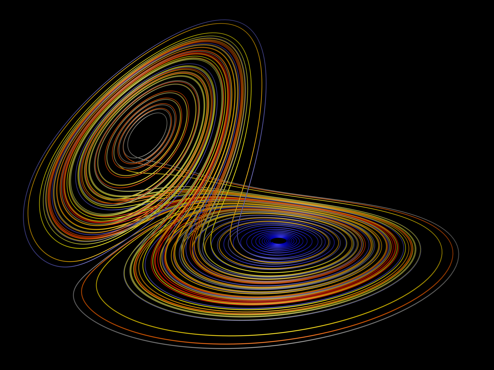

import { Steps } from '@astrojs/starlight/components';

## Generación procedural

- [Sebastian Lague Procedural Terrain Generation](https://youtube.com/playlist?list=PLFt_AvWsXl0eBW2EiBtl_sxmDtSgZBxB3)
- [Catlike Coding Noise Derivatives, going with the flow](https://catlikecoding.com/unity/tutorials/pseudorandom-noise/)
- [t3ssel8r Giving Personality to Procedural Animations using Math](https://youtu.be/KPoeNZZ6H4s)
- [Codeer Introduction To My Weird Shooter Game - Devlog 0](https://youtu.be/NoJXn-Fh6CU)
- [Codeer Unity procedural animation tutorial (10 steps)](https://youtu.be/e6Gjhr1IP6w)
- [Unity Creating a boss with procedural animation | Prototype Series](https://youtube.com/playlist?list=PLX2vGYjWbI0SwlTX_RLSD0JmzUeS0f1OK)
- [GENERATIVE ART 101](https://derivative.ca/community-post/generative-art-101-surprising-connection-between-math-art-and-nature/62742)
- [Generative art](https://en.wikipedia.org/wiki/Generative_art)
- [Algorithmic art](https://en.wikipedia.org/wiki/Algorithmic_art)
- [Artificial intelligence art](https://en.wikipedia.org/wiki/Artificial_intelligence_art)
- [Generative Art](https://cognitiveexperience.design/generative-art/)
- [CodeParade](https://www.youtube.com/@CodeParade/featured)
- [How to Use the New Simulation Nodes in Blender 3.6 LTS](https://youtu.be/RJbLiFTNHnI)
- [Procedural Animation for Humans](https://youtu.be/QdETstMgJO8?si=7YhM_AX6slgtAi2E)
- [Generative artistry](https://generativeartistry.com/)
- [Generative Art Guide](https://aiartists.org/generative-art-design)
- [The Procedural Animation of Gibbon: Beyond the Trees - Wolfire Games](https://youtu.be/KCKdGlpsdlo?si=sqlHs2EpPVSxkb-K)
- [Nabil Mansour YouTube channel](https://www.youtube.com/@nabilnymansour/videos)
- [FRACTAL GLIDE YouTube playlist](https://youtube.com/playlist?list=PL2F1Dd07Dx_3xxo50yWGAD4ncEhgKFkyH&si=FiA5WmpiE86Umcbe)
- [Fractal Ray Marching in Blender (Geometry Nodes)](https://youtu.be/eIZ97sP6xAg?si=a61gifnwLb36blFs)
- [Real-time diffusion in TouchDesigner - StreamdiffusionTD Setup + Install + Settings](https://youtu.be/X4rlC6y1ahw?si=LMCEYYQwRyuPgjXx)
- [A simple procedural animation technique](https://youtu.be/qlfh_rv6khY?si=eMBrrvk5LyHMA7JQ)
- [My Favorite Tools + Techniques for Procedural Gamedev](https://cprimozic.net/blog/tools-and-techniques-for-procedural-gamedev/)
- [Procedural modeling of cities](https://phiresky.github.io/procedural-cities/)
- [Interactive Procedural Street Modeling](https://www.sci.utah.edu/~chengu/street_sig08/street_project.htm)
- [Demo WebGPU by Utsubo Japan](https://2024.utsubo.com/)
- [WebGPU is Not Just about the Web](https://youtu.be/qHrx41aOTUQ?si=3Pm6YZfWfNP4ZoMT)
- [gpu.cpp GitHub repo](https://github.com/AnswerDotAI/gpu.cpp)
- [WebGPU Samples GitHub repo](https://github.com/webgpu/webgpu-samples)
- [q5.js - The spiritual successor to p5.js and Processing Java](https://q5js.org/home/)
- [3Angle WebGPU tutorials YouTube channel](https://www.youtube.com/@3Angle_/playlists)
- [Lecture 27: gpu.cpp - Portable GPU compute using WebGPU](https://youtu.be/Ll5Sr1L5LvA?si=GUPtjpQCB255u0Pc)

## Rendering

- [The Future of Rendering - Jules Urbach](https://youtu.be/KlY3K2TnrAk?si=JflRiZkIfPFhon3H)

## WebGPU

- [Introducing WebGPU: Unlocking modern GPU access for JavaScript](https://youtu.be/m6T-Mq1BPXg?si=nkdEfpjpsJGNA1sF)
- [Diseño WEB con programación visual en cables.gl](https://youtube.com/playlist?list=PLNiHKzKZc4rKfZvFNdPS6qCLjKN2OV29a&si=B2CbcZSob4YTnymi)
- [Play Canvas](https://playcanvas.com/)
- [Babylonjs](https://www.babylonjs.com/)
- [WebGPU API](https://developer.mozilla.org/en-US/docs/Web/API/WebGPU_API)
- [WebGPU Tutorial: Advanced Graphics on the Web Course](https://youtu.be/KTFFdZSDiTU?si=VM8ZE9XdkUU8ECP7)
- [Webgpu samples](https://webgpu.github.io/webgpu-samples/)
- [Your first WebGPU app](https://codelabs.developers.google.com/your-first-webgpu-app#0)
- [Practical Programming with Dr. Xu](https://www.youtube.com/@PracticalProgrammingwithDrXu/videos)
- [WebGPU :: Rendering the future in Real-Time](https://youtu.be/YinfynTz77s?si=_JXcVRF7yz2QrNtY)
- [Modern 3D Graphics Beginner Projects in WebGPU](https://shrekshao.github.io/3d-graphics-beginner-projects/)
- [Learn WebGPU – A next-generation graphics API for the web](https://www.freecodecamp.org/news/learn-webgpu-a-next-generation-graphics-api-for-the-web)
- [Awesome WebGPU - Recursos interesantes de WebGPU](https://github.com/mikbry/awesome-webgpu)
- [Unlock the Potential of AI and Immersive Web Applications with WebGPU](https://www.intel.com/content/www/us/en/developer/articles/technical/unlock-potential-ai-immersive-web-apps-with-webgpu.html)
- [WebGPU :: Javascript at the speed of Light](https://youtu.be/oAwlk0j5RUM?si=0Wv9EaQGjGRNSn8Z)
- [WebGPU from WebGL](https://webgpufundamentals.org/webgpu/lessons/webgpu-from-webgl.html)
- [WebGPU Compute Shader Basics](https://webgpufundamentals.org/webgpu/lessons/webgpu-compute-shaders.html)
- [WebGPU — All of the cores, none of the canvas](https://surma.dev/things/webgpu/)
- [Get started with GPU Compute on the web](https://developer.chrome.com/docs/capabilities/web-apis/gpu-compute)
- [How to Build a Compute Rasterizer with WebGPU](https://github.com/OmarShehata/webgpu-compute-rasterizer/blob/main/how-to-build-a-compute-rasterizer.md)
- [What WebGPU Means to XR and Metaverse by Andrey Ivashentsev](https://youtu.be/5DgkmgH8zJQ?si=85q-YBk-SdnvVo-p)
- [Generative Coding - The Nature of Code Ported to Three.js](https://quaintitative.com/noc_port_threejs/)
- [WebGPU Fluid Simulation](https://kishimisu.github.io/WebGPU-Fluid-Simulation/)
- [Taichi.js: Painless WebGPU Programming](https://taichi-js.com/docs/articles/painless-webgpu-programming)
- [Taichi.js example on cables.gl](https://cables.gl/p/eux4Vb)
- [The best of WebGPU each month - WebGPUExperts](https://www.webgpuexperts.com/)
- [Blob by WebGPU Experts](https://www.webgpuexperts.com/blobs)

## Web ML

- [What's new with Web ML in 2023](https://youtu.be/r7hOoCY6uGo?si=G2FcGgN-GzRl-3ni)
- [Visual Blocks for ML](https://visualblocks.withgoogle.com/)
- [Google machine learning courses](https://ai.google/build/machine-learning)
- [Machine Learning for Web Developers (Web ML)](https://youtube.com/playlist?list=PLOU2XLYxmsILr3HQpqjLAUkIPa5EaZiui&si=_YoTv7bfW9ZHvShV)
- [Getting Started with audio classification for web using MediaPipe Solutions](https://youtu.be/Lo-0q6l0btA?si=AJhzQM8aWqtbiInF)
- [Getting started with pose landmark detection for web using MediaPipe Solutions](https://youtu.be/oaK74yozU9g?si=kgln7VbjwdrPLkya)
- [Getting started with text classification for web using MediaPipe Solutions](https://youtu.be/0RoP4nwLO9c?si=olLXlRYV24sJjgAG)
- [Getting Started with face detection for web using MediaPipe Solutions](https://youtu.be/3JctK0PJ_co?si=jiK7lai2Nt43LZnG)
- [Visual Blocks ML: Create AI demos faster using custom nodes for your favorite APIs](https://youtu.be/zeFxny7KSlY?si=1yBf8phz9ASoUL_X)
- [Machine Learning for the Web class at ITP, NYU](https://github.com/yining1023/machine-learning-for-the-web)
- [Introduction to Machine Learning for the Arts](https://github.com/ml5js/Intro-ML-Arts-IMA-F24)
- [Google Machine Learning Crash Course](https://developers.google.com/machine-learning/crash-course/)
- [Neural networks - 3Blue1Brown Course](https://youtube.com/playlist?list=PLZHQObOWTQDNU6R1_67000Dx_ZCJB-3pi&si=gc5ArcWGvr0CEEQb)
- [A Beginner's Guide to Machine Learning in JavaScript with ml5.js](https://thecodingtrain.com/tracks/ml5js-beginners-guide)
- [Machine Learning Course by Radu Mariescu-Istodor](https://youtube.com/playlist?list=PLB0Tybl0UNfYe9aJXfWw-Dw_4VnFrqRC4&si=W0zTy5EjXsfatRot)

## WebXR

- [WebXR App Wonderland Engine](https://wonderlandengine.com/)
- [Mattercraft - The next generation of 3D web tooling](https://zap.works/mattercraft/)
- [WebXR in Mattercraft: Rapid AR/VR creation for Apple Vision Pro, Quest 3 & ML2](https://youtu.be/1y40Y3wdpCY?si=4xBb4s3dzVk2vsRv)
- [Switching from Unity to Wonderland Engine](https://youtu.be/7pbMqmBMW94?si=L41ws71o3eZjHiCO)
- [WebXR API - Immersive Web](https://immersiveweb.dev/)
- [How to use WebXR with Unity - January 2024 Edition](https://youtu.be/4wQG8_pb3cs?si=kOLnrpmI8R3nLDlF)
- [Top 5 WebXR Frameworks - Comparison by Jonathan Hale](https://wonderlandengine.com/news/top-5-webxr-frameworks-comparison/)
- [State of Compute: Maximizing Performance on Meta Quest](https://youtu.be/M6RKMXQbtWk?si=uv12lVXk_AI6b0za)
- [Reality Accelerator Toolkit](https://github.com/meta-quest/reality-accelerator-toolkit)
- [WebXR App Wonderland Engine](https://wonderlandengine.com/)
- [Mattercraft - The next generation of 3D web tooling](https://zap.works/mattercraft/)
- [WebXR in Mattercraft: Rapid AR/VR creation for Apple Vision Pro, Quest 3 & ML2](https://youtu.be/1y40Y3wdpCY?si=4xBb4s3dzVk2vsRv)
- [Switching from Unity to Wonderland Engine](https://youtu.be/7pbMqmBMW94?si=L41ws71o3eZjHiCO)
- [WebXR API - Immersive Web](https://immersiveweb.dev/)
- [How to use WebXR with Unity - January 2024 Edition](https://youtu.be/4wQG8_pb3cs?si=kOLnrpmI8R3nLDlF)
- [Top 5 WebXR Frameworks - Comparison by Jonathan Hale](https://wonderlandengine.com/news/top-5-webxr-frameworks-comparison/)
- [State of Compute: Maximizing Performance on Meta Quest](https://youtu.be/M6RKMXQbtWk?si=uv12lVXk_AI6b0za)
- [Reality Accelerator Toolkit](https://github.com/meta-quest/reality-accelerator-toolkit)

## Tools

- [Textfx](https://textfx.withgoogle.com/)
- [AutoDraw](https://www.autodraw.com/)
- [Cables](https://cables.gl/)
- [Effect House Tik Tok realidad aumentada](https://effecthouse.tiktok.com/)
- [Meta Spark realidad aumentada](https://spark.meta.com/)
- [n8n - Secure, AI-native workflow automation](https://n8n.io/)

## Cursos

- [Blender: Geometry Nodes from Scratch](https://studio.blender.org/training/geometry-nodes-from-scratch/)
- [Get started making music](https://learningmusic.ableton.com/)
- [3D Computer Graphics Programming](https://pikuma.com/courses/learn-3d-computer-graphics-programming)
- [p5.js shaders](https://itp-xstory.github.io/p5js-shaders/#/)
- [Chris courses game dev with JavaScript](https://chriscourses.com/courses)
- [HTML5 Canvas Tutorials for Beginners | Become a Canvas Pro](https://youtube.com/playlist?list=PLpPnRKq7Uu3We9VdCfx9fprhqXHwTPXL&si=OdLxkmhE_2jUTr8g)
- [JavaScript Audio CRASH COURSE For Beginners](https://youtube.com/playlist?list=PLYElE_rzEw_sHeIIv7BMliQF5zB7BliJE&si=ybWqYuXN5Z_hrVx7)
- [Design for Developers](https://www.enhanceui.com/)
- [Introduction to Cables.gl and Javascript coding](https://youtube.com/playlist?list=PLigMhZPczouVkDLB3Ji66M3K0frprOXW5&si=TVIKrB0mJbLBAF32)
- [Lusion Labs](https://labs.lusion.co/about)
- [Utsubo Creative Studio in Japan](https://www.utsubo.com/)
- [Painting with Plotters](https://www.eyesofpanda.com/project/painting_with_plotters/)

## Artistas, diseñadores, studios

- [Casey Reas](https://reas.com/)
- [feralfile](https://feralfile.com/about)
- [Tony DeRose](https://youtu.be/_IZMVMf4NQ0)
- [Tony DeRose](https://youtu.be/mX0NB9IyYpU)
- [Bruno Imbrizi](https://www.brunoimbrizi.com/about)
- [Matt Deslauriers](https://www.mattdesl.com/)
- [Yi-Wen Lin (Wen)](https://yiwenl.github.io/)
- [Patrik Hübner](https://www.patrik-huebner.com/)
- [nowhere2run](https://www.nowhere2runproductions.com/)
- [Tim Rodenbröker](https://timrodenbroeker.de/)
- [Thomas Latvys](https://www.instagram.com/thomaslatvys/reels/)
- [Entagma](https://entagma.com/)

## Books

- [Basic Math for Game Development with Unity 3D](https://link.springer.com/book/10.1007/978-1-4842-5443-1#toc)
- [Computational Geometry: Algorithms and Applications](https://www.amazon.com/Computational-Geometry-Applications-Mark-Berg/dp/3540779736/)
- [3D Math Primer for Graphics and Game Development](https://gamemath.com/book/intro.html)
- [The Unity Shaders Bible](https://www.jettelly.com/books/unity-shaders-bible/)
- [Generative Design: Visualize, Program, and Create with JavaScript in p5.js](https://www.amazon.com/Generative-Design-Visualize-Program-JavaScript/dp/1616897589)
- [Generative Design, Creative Coding on the Web](http://www.generative-gestaltung.de/2/)
- [Generative Design Code Package (for P5.js)](https://github.com/generative-design/Code-Package-p5.js)
- [The Nature of Code 2](https://nature-of-code-2nd-edition.netlify.app/)
- [The Book of Shaders](https://thebookofshaders.com/)
- [Programming Design Systems](https://programmingdesignsystems.com/)
- [Generative Design](https://drive.google.com/file/d/1C8MbPfDba0QL6VIObjdA1f9HA_euK6Bf/view?usp=sharing)
- [SDL Game Development](https://github.com/juanferfranco/privateBooks/blob/main/Shaun%20Mitchell%20-%20SDL%20Game%20Development-Packt%20Publishing%20(2013).pdf)
- [Generative Design Books Worth Reading](https://interactiveimmersive.io/blog/interactive-media/generative-design-books-worth-reading/)
- [WebGPU Unleashed: A Practical Tutorial by Shi Yan](https://shi-yan.github.io/webgpuunleashed/)

## Math

- [Fundamental Math for Game Developers](https://pikuma.com/blog/math-for-game-developers)
- [Linear Algebra for Games](https://www.youtube.com/watch?v=JHXUU5aqIcg)
- [Essential Mathematics For Aspiring Game Developers](https://www.youtube.com/watch?v=DPfxjQ6sqrc)
- [Math For Video Games: The Fastest Way To Get Smarter At Math](https://www.udemy.com/course/math-for-games/)
- [Introduction to Unity.Mathematics - Unite Copenhagen](https://www.youtube.com/watch?v=u9DzbBHNwtc)
- [Unity Math Playlist](https://youtube.com/playlist?list=PLMj5RSRN1rwp0R01nByvvYUvffoEyStzk)
- [This equation will change how you see the world (The Logistic Map)](https://youtu.be/ovJcsL7vyrk)
- [The Map of Mathematics](https://youtu.be/OmJ-4B-mS-Y)
- [Differential equations, a tourist's guide](https://youtu.be/p_di4Zn4wz4)
- [Numerical Simulation of Ordinary Differential Equations](https://youtu.be/QBeNXHrAYns)
- [Simulate Coupled Differential Equations in Python](https://youtu.be/zRMmiBMjP9o)
- [Chaos Equations - Simple Mathematical Art by CodeParade](https://youtu.be/7JMDqrCKlAk)
- [Chaos: The Science of the Butterfly Effect](https://youtu.be/fDek6cYijxI)

## Física

- [The relationship between chaos, fractals, and physics](https://youtu.be/C5Jkgvw-Z6E)
- [The Map of Physics](https://youtu.be/ZihywtixUYo)

## Sitios

- [Use math to solve problems in Unity with C#](https://www.habrador.com/tutorials/math/)
- [Manim: Community-maintained Python library for creating mathematical animations](https://www.manim.community/)
- [Interpolation and Control Systems](https://gamemath.com/gdc2021/)
- [Spring-It-On: The Game Developer's Spring-Roll-Call](https://theorangeduck.com/page/spring-roll-call)
- [Should I Write a Game Engine or use an Existing One?](https://pikuma.com/blog/why-make-a-game-engine)
- [Generative Design in Branding](https://www.patrik-huebner.com/how-to-use-generative-design-in-branding/)
- [Generative Design Method](https://www.patrik-huebner.com/method/)
- [Handwrytten](https://www.handwrytten.com/)
- [CineShader: Real-time 3D shader visualizer](https://cineshader.com/)

## Videos

- [Cómo hacer EFECTOS de PARTÍCULAS en Unity | Tutorial VFX](https://youtu.be/4ZffPhom758)
- [Differential Equations and Dynamical Systems: Overview](https://youtu.be/9fQkLQZe3u8)
- [3Blue1Brown Differential equations, a tourist's guide](https://youtu.be/p_di4Zn4wz4)
- [Solar System Simulation [Unity 3D Tutorial]](https://youtu.be/2fGL1QWMdqc)
- [How to Set Up Dynamic Water Physics and Boat Movement in Unity](https://youtu.be/eL_zHQEju8s)
- [Learn how to use a geometry feedback loop to create a differential growth animation in Blender](https://youtu.be/zMODkMdc8Ec)

## Optimización

- [How to Actually optimize your game in Unity - Complete Game Optimization Guide](https://youtu.be/ysk7ATmIeOs)

## Portafolios

- [Jellever](https://www.jellever.be/)
- [Jelle story telling idea](https://youtu.be/CTvbuqRCoKk)
- [Andrea Gonzalez - Profe de IDED](https://drive.google.com/file/d/1OpKvM0XYEKNzZuHbyix1ohnfU5JwGGWI/view?usp=sharing)
- [Mateusz Grad](https://www.behance.net/gallery/139111749/Fundi-UIUX-App-Design?tracking_source=search_projects)
- [Gapsy Studio - Pickle Mobile UI/UX for Social App](https://www.behance.net/gallery/139545717/Pickle-Mobile-UIUX-for-Social-app?tracking_source=search_projects)
- [Gapsy Studio - MyLagro Website & Mobile App](https://www.behance.net/gallery/114257749/MyLagro-Website-Mobile-App)
- [Fabian Shinzato - Bloom UX/UI](https://www.behance.net/gallery/104515801/Bloom-UXUI?tracking_source=search_projects)
- [Allison Winter](https://www.allisonwinter.com/)
- [Koenvo](https://www.koenvo.com/)
- [Dennis Snellenberg](https://dennissnellenberg.com/)
- [Brandon Hampton](https://www.bhamps.com/)
- [Luca Vonilo](https://lucavolino.com/)
- [Greg Koberger](https://gkoberger.com/)
- [Paco Coursey](https://paco.me/)
- [Rauno Freiberg](https://rauno.me/)
- [Naxo](https://naxo.dev/)
- [Jesse Zhou](https://jesse-zhou.com/)
- [Bruno Simon](https://bruno-simon.com/)
- [Alex Pierce](https://www.behance.net/alexpierce/moodboards)
- [Embed](https://astolfo.co/)
- [Anthony Fu](https://antfu.me/_)
- [Niccolo Miranda](https://www.niccolomiranda.com/)
- [Gass Zone](https://www.gass.zone/)
- [Minh Pham](https://minhpham.design/)
- [Gabriel Bianchi](https://www.gabrielbianchi.com/)
- [Guillaume Reygner](https://guillaumereygner.fr/)
- [Dan Abramov](https://danabra.mov/)
- [Edan Kwan](https://edankwan.com/)
- [David Hckh](https://www.david-hckh.com/)
- [Johan Digital](https://www.johandigital.com/)
- [9 Imaginative Web Designer Portfolio Examples to Inspire Your Own](https://www.vev.design/blog/web-designer-portfolio-examples/)
- [Build a Mindblowing 3D Portfolio Website // Three.js Beginner’s Tutorial](https://youtu.be/Q7AOvWpIVHU?si=9lLanEQZYVjlu1Gw)

## Video references

- [In My Room (Audio) - Jacob Collier](https://youtu.be/7dSFMUcTuhU?si=AV9bAEysVxjdwSH8)
- [20 Best Music Videos that Story Tell - Narrative Music Video](https://youtube.com/playlist?list=PL1487B0A90D0B66E5&si=5Sw8PuraemjgboJI)
- [Jacob Collier - Never Gonna Be Alone (feat. Lizzy McAlpine & John Mayer)](https://youtu.be/NMo4608Q-YM?si=295w5GO9O9VwauYT)
- [SIAMÉS "Mr. FEAR" (Official Animated Music Video)](https://youtu.be/EKLWC93nvAU?si=olCX5dGjSKDABiJ6)
- [Animated Music Videos](https://youtube.com/playlist?list=PL5vdhFFAsayGulXn_5G1iBlGhdQ5BtZ_9&si=k1IxbIEKICzrkpNl)
- [Audioreactive Video - Playhead (TouchDesigner)](https://youtu.be/VAqvZENdOdU?si=ijhJ__CqP3H7-R8G)

## Audio

- [Audio Signal Processing for Machine Learning](https://youtube.com/playlist?list=PL-wATfeyAMNqIee7cH3q1bh4QJFAaeNv0&si=ysMPWk94ejzKZdDc)
- [Real-time Audio Analysis Using the Unity API](https://medium.com/@jesse_87798/6e9595823ce4)
- [Audio reactive cables.gl](https://youtube.com/playlist?list=PLYimpE2xWgBvidgEPR6sFlpbqYRo6yjVJ&si=M1lxPhevnF1YUupT)
- [JavaScript Audio Effects by Franks Laboratory](https://youtube.com/playlist?list=PLYElE_rzEw_sHeIIv7BMliQF5zB7BliJE&si=9TUOkpeqEKKwIidL)

## StoryTelling

- [Word as Image - Playlist](https://youtube.com/playlist?list=PLRTCqZ12WNaCWu43EZ2Cg_Micos0QDshf&si=Jsnl-G1Iqh7Rusf7)
- [Word as Image by Ji Lee](https://pleaseenjoy.com/#/word-as-image/)
- [2015 Word as Image Highlights](https://youtu.be/qkrlKXyLWYI?si=RfsZtv1n2dYEDxYG)
- [Word As Image for Semantic Typography](https://wordasimage.github.io/Word-As-Image-Page/)
- [DS-Fusion: Artistic Typography via Discriminated and Stylized Diffusion](https://ds-fusion.github.io/)

## Trends

- [Motion Graphics Trends [2023]](https://www.youtube.com/watch?v=W2ib79OoK2k)
- [Top 2024 Web Design Trends](https://youtu.be/qthkkHPNAYQ?si=4C-6K2WhgPcdGYML)

## Papers

- [Advanced Character Physics by Thomas Jakobsen](https://github.com/juanferfranco/SimulacionInteractivos/tree/main/docs/_static/Jakobsen.pdf)
- [StreamDiffusion: A Pipeline-level Solution for Real-time Interactive Generation](https://arxiv.org/abs/2312.12491)
- [The Fractal Flame Algorithm](https://flam3.com/flame_draves.pdf)
- [DyNCA: Real-Time Dynamic Texture Synthesis Using Neural Cellular Automata](https://dynca.github.io/)
- [Computational Life: How Well-formed, Self-replicating Programs Emerge from Simple Interaction](https://arxiv.org/pdf/2406.19108)

## Data Viz

- [The Art of Data Visualization | Off Book | PBS Digital Studios](https://youtu.be/AdSZJzb-aX8?si=B3rtWKJRxK-tapS0)
- [Data Art](https://youtu.be/23o6I3x6Cbw?si=q5ZuWFgM0cCjJQnD)
- [Data Art Tutorials with cables.gl](https://youtube.com/playlist?list=PLqebJ3CSuDa_keY_P87d1cr740qH4cT0E&si=AI7yqorvd_mNPYbs)

## Games

- [Create a 3D Multi-player Game using THREE.js and SOCKET.io](https://youtube.com/playlist?list=PLcTpn5-ROA4yXDPO4o38q9JLlJtu3EUMj&si=2_3aW3EfNsrbR0zC)
- [Making the same game in Three.js and Unity](https://youtu.be/r6ZvU2U-DB0?si=vcRnCVJ7AfqYzmxt)
- [Fractal Glide (Steam game)](https://store.steampowered.com/app/2565200/Fractal_Glide/)
- [Noita (Steam game)](https://store.steampowered.com/app/881100/Noita/)
- [Exploring the Tech and Design of Noita](https://youtu.be/prXuyMCgbTc?si=CTGFQoYsl2DtUeQh)
- [Recreating Noita's Sand Simulation in C and OpenGL](https://youtu.be/VLZjd_Y1gJ8?si=0K6JS85Ijj_FXSfS)
- [Sandspiel (Game with pixels)](https://sandspiel.club/)
- [Making a falling sand simulator](https://jason.today/falling-sand)

## p5.js

- [WebGL - p5.js Tutorial](https://youtube.com/playlist?list=PLRqwX-V7Uu6bPhi8sS1hHJ77n3zRO9FR_&si=r5Qma-lD_5eo0AL6)
- [Topics of JavaScript/ES6-ES8 - p5.js Tutorial](https://youtube.com/playlist?list=PLRqwX-V7Uu6YgpA3Oht-7B4NBQwFVe3pr&si=8Pt5m8NXsYuNYnls)
- [Physical computing course by Makeability Lab](https://makeabilitylab.github.io/physcomp/)
- [Live Server for p5.js applications (VS Code)](https://github.com/processing/p5.js/wiki/Local-server#vs-code-live-server)
- [Debugging JavaScript with Microsoft Edge](https://learn.microsoft.com/en-us/microsoft-edge/devtools-guide-chromium/javascript/)
- [Intro to Computational Media - Curriculum using p5.js](https://cs4all-icm.gitbook.io/js-intro-to-computational-media-2.0)

## SDF (Signed Distance Functions)

- [I Made A Blob Shooting Game With Ray Marching](https://youtu.be/9wZL2RzBQyE?si=brmvkHPOS8Xh921a)
- [Volumetrics: Introduction to Ray Marching](https://youtu.be/hXYOlXVRRL8?si=o4ed1nozxv5MEvBo)
- [Ray Marching and making 3D Worlds with Math](https://youtu.be/BNZtUB7yhX4?si=gNZA640rb1uWP7QY)
- [Coding Adventure: Ray Marching](https://youtu.be/Cp5WWtMoeKg?si=9tdKFO-Lrpf1J382)
- [Ray Marching Project (Sebastian Lague)](https://github.com/SebLague/Ray-Marching)
- [Distance functions](https://iquilezles.org/articles/distfunctions/)
- [Ray Marching and Signed Distance Functions Tutorial](https://jamie-wong.com/2016/07/15/ray-marching-signed-distance-functions/#the-raymarching-algorithm)
- [Ray Marching for Dummies](https://youtu.be/PGtv-dBi2wE?si=U1XFie0CjJsWb0gH)

## Live

- [Making of – Ed Sheeran Mathematics Tour](https://youtu.be/hEMQ9fZnbTU?si=ZOPKuTY9KO3OTwkM)
- [David Guetta Live on GrandMA2 | Lightshow](https://youtu.be/TrIYm1E4QIE?si=L0YmTLWI5kklg7zd)
- [BROADCAST & LIVE EVENTS with Unreal Engine](https://www.unrealengine.com/en-US/solutions/broadcast-live-events)
- [Moment Factory Previz Project](https://www.unrealengine.com/en-US/spotlights/moment-factory-collaborates-with-epic-on-live-event-previs-dmx-sample-project-available-now)
- [Unreal Live Link](https://docs.unrealengine.com/5.3/en-US/live-link-in-unreal-engine/)

## Virtual Production

- [Soluciones ópticas Stype](https://stype.tv/)
- [Caso de estudio: Fox Sports](https://youtu.be/rOe6Gw9TvJg?si=T4mqykHkziAoGHOb)
- [Vizrt: Real-time graphics and live production solutions for content creators](https://www.vizrt.com/vizrt/)
- [Erizos: Real-time Broadcast Graphics Solutions](https://www.erizos.tv/we-are-erizos/)

## Physical Computing Simulation

- [Hyperreal wingsuit simulator](https://www.unrealengine.com/en-US/spotlights/meet-jump-the-world-s-first-hyperreal-wingsuit-simulator)
- [Hyperreal simulator: JUMP](https://www.limitlessflight.com/)
- [James Jensen, uno de los creadores de The Void](https://www.linkedin.com/in/jimason3d/)
- [The Void](https://www.thevoid.com/)

## Creative Coding

- [Where there is data, there is design - Patrik Hübner](https://www.patrik-huebner.com/)
- [Creative Coding = Unexplored Territories | Tim Rodenbröker | TEDxUniPaderborn](https://youtu.be/JW7oAbLVNJE?si=RzfjvoMckC-621P6)
- [Tim Rodenbroeker site](https://timrodenbroeker.de/)
- [Creative Coding as a School of Thought](https://timrodenbroeker.de/creative-coding-as-a-school-of-thought/)
- [What is Creative Coding?](https://timrodenbroeker.de/what-is-creative-coding/)
- [A Creative Coding Method - Patrik Hübner](https://www.patrik-huebner.com/method/)

## Unity

- [Introduction to the Universal Render Pipeline for Advanced Unity Creators](https://unity.com/resources/introduction-universal-render-pipeline-for-advanced-unity-creators?ungated=true&elqTrackId=c5aaaadf457b42e9997e3da2d269acfa&elqaid=4611&elqat=2&utm_source=none&utm_medium=referral&isGated=false)
- [The Universal Render Pipeline Cookbook](https://github.com/juanferfranco/privateBooks/blob/main/Unity_Ebook_Universal-Render-Pipeline_Cookbook.pdf)
- [Level up your programming with game programming patterns](https://unity.com/resources/level-up-your-code-with-game-programming-patterns)
- [Simplified Clean Architecture Design Pattern for Unity](https://genki-sano.medium.com/simplified-clean-architecture-design-pattern-for-unity-967931583c47)
- [Software Architecture in Unity - YouTube](https://youtu.be/sh7f4K9Wbj8?si=d-MzYIeq5t-uYtca)
- [Learn Unity Beginner/Intermediate 2023 (Free Complete Course)](https://youtu.be/AmGSEH7QcDg?si=aWlL3gFK70CWM8Lx)

## Web Libraries

- [Animation with Greensock (GSAP)](https://gsap.com/)
- [Three.js](https://threejs.org/)

## Design

- [Resilient Web Design by Jeremy Keith](https://resilientwebdesign.com/)
- [Design for Developers by MDN Curriculum](https://developer.mozilla.org/en-US/curriculum/core/design-for-developers/)
- [The latest in Material Design (Google I/O 2024)](https://youtu.be/XQ_Hvu-s7JY?si=egpHBL57gtPTvQYg)

## Immersive Web Experiences

- [Become a Three.js Developer (Course)](https://threejs-journey.com/)
- [What Are Interactive Websites?](https://www.vev.design/interactive-websites/)
- [10 Striking 3D Website Examples (and How They’re Made)](https://www.vev.design/blog/3d-website-examples/)

## Interactive Web Experiences

- [Incredibox - Music Interactive Experience](https://www.incredibox.com/)
- [Chrome Music Experiments](https://musiclab.chromeexperiments.com/Experiments)
- [Visualizing Music with p5.js](https://therewasaguy.github.io/p5-music-viz/)
- [Cursos de cables.gl](https://www.youtube.com/@Decode_gl/videos)
- [Lights and Shadows Operators - Getting Started](https://youtu.be/knGnukutZeM?si=mrHDX8QDS8DwUqEl)

## Blender

- [Math x Blender = Power!](https://youtu.be/vTJWByS3Pi4?si=wxwtcPbT58xNEdeE)
- [How to Simulate a 100.000+ Fish Swarm in Blender!](https://youtu.be/bpyilKAY2fM?si=S7bh4-UiaP5nN84g)
- [Geometry Nodes Tutorials - YouTube Playlist](https://youtube.com/playlist?list=PLmRFYLlxqAdPQi6UeINnr-VXOscRrgGI4&si=3t3hcSIgYWxDDnin)
- [The Big Nodebook: A Geometry Nodes Guide](https://mtranimationgumroad.gumroad.com/l/thebignodebook)

## TED Talks

- [Lucas Rizzoto: Why I built my own time machine](https://www.ted.com/talks/lucas_rizzotto_why_i_built_my_own_time_machine)
- [Jorge Drexler: Poetry, music, and identity](https://www.ted.com/talks/jorge_drexler_poetry_music_and_identity)

## Biology

- [Algorithmic Botany](http://algorithmicbotany.org/)
- [The Algorithmic Beauty of Plants](http://algorithmicbotany.org/papers/#abop)

## Conferences

- [Conference on Artificial Life](https://2024.alife.org/)
- [ITERATIONS](https://iterations.online/)
- [Swiss Design Network Symposium](https://researchday.ch/)

## Generative Art

- [Algorithmic Art as a subset of Generative Art](https://monokai.com/articles/algorithmic-art-as-a-subset-of-generative-art)
- [Generative Art for Beginners - YouTube Playlist](https://youtube.com/playlist?list=PLYElE_rzEw_tN_lGjsx8uK85k-xZc4yrl&si=Z8KGbTsLrGE7A06e)
- [Generative Art Museum](https://responsivedreams.com/)
- [TCAM Generative Art Museum](https://tgam.xyz/about)
- [Mathematical Art Digital Exhibition (MADE)](https://www.qc.cuny.edu/academics/math/made-gallery/)
- [Demystifying Generative Art](https://www.lerandom.art/editorial/demystifying-generative-art)
- [Drawing Robots](https://drawingbots.net/)

## Shading Languages

- [TSL: Three.js Shading Language](https://github.com/mrdoob/three.js/wiki/Three.js-Shading-Language)
- [TSL Textures](https://boytchev.github.io/tsl-textures/)

## Artificial Life

- [DyNCA: Real-Time Dynamic Texture Synthesis Using Neural Cellular Automata](https://dynca.github.io/)
- [NoiseNCA: Noisy Seed Improves Spatio-Temporal Continuity of Neural Cellular Automata](https://noisenca.github.io/)
- [Computational Life: How Well-formed, Self-replicating Programs Emerge from Simple Interaction](https://arxiv.org/abs/2406.19108)
- [Cellular ASCIIMata - Playground](https://openprocessing.org/sketch/2326268)

## Touch Designer

- [StreamDiffusionTD 0.2.0 - Installation + Setup](https://youtu.be/F2JSWAKex4k?si=ayFiWLqgrGHksRWG)
- [StreamDiffusion](https://github.com/cumulo-autumn/StreamDiffusion)
- [StreamV2V](https://youtu.be/k-DmQNjXvxA?si=u7LXWd8xfU6ubHbs)
- [Making Games in TouchDesigner](https://youtu.be/5GKXyOgsR9U?si=5VztKdHDsIX7wBCq)

## OpenGL

- [Learn OpenGL](https://learnopengl.com/)

## Web Topics

- [Implementing React From Scratch](https://www.rob.directory/blog/react-from-scratch)
- [Plain Vanilla Components](https://plainvanillaweb.com/pages/components.html)

## Hardware

- [What is the Colmi R02?](https://tahnok.github.io/colmi_r02_client/colmi_r02_client.html#what-is-the-colmi-r02)

## Creative Algorithms

- [Evolving JavaScript: Cultivating Genetic Algorithms for Creative Coding](https://youtu.be/OBI87TdFXwc?si=s1BTMOXJkjlTApsx)
- [That Creative Code Page](https://available-anaconda-10d.notion.site/That-Creative-Code-Page-c5550ef2f7574126bdc77b09ed76651b)
- [p5.js Coding Tutorial | Differential Line Growth](https://youtu.be/1viK2qKuP-Y?si=IPn8ARXl4TG-m5w0)
- [p5.js Coding Tutorial | Flocking Simulation with Quadtree](https://youtu.be/AMugNCfP1NA?si=cPuKoGIBhxBtNKFb)
- [Punch Out Model Synthesis: A Stochastic Algorithm for Constraint-Based Tiling Generation](https://zzyzek.github.io/PunchOutModelSynthesisPaper/)

## Projection Mapping

- [Real-time Projection Mapping with WebGPU](https://www.webgpuexperts.com/exploring-projection-mapping-webgpu)

## Coding Techniques

- [JavaScript Patterns](https://www.patterns.dev/vanilla/factory-pattern)
- [JavaScript ES6 - How to Use p5.js in a Module](https://youtu.be/P0bkwncSJag?si=wkv5jW5pzHg-uMhu)
- [JavaScript Promises](https://youtube.com/playlist?list=PLRqwX-V7Uu6bKLPQvPRNNE65kBL62mVfx&si=Q3RwRPCntmANY6qE)
- [HTML Canvas Deep Dive](https://youtu.be/uCH1ta5OUHw?si=zOEO-fcMIbjAQ8Ih)

## Generative Design

- [Design Lecture Series - Patrik Hübner](https://youtu.be/BZVQYJJDnSU?si=kDYBS6ILAaGWD8Si)
- [Generative Design by Patrik Hübner](https://www.patrik-huebner.com/how-to-use-generative-design-in-branding/)
- [Generative Design, Vera van de Seyp](https://youtu.be/2K6nRgSJ8dI?si=M0Uq0BNzHkxC_CQ_)


## Ejemplos

### Borrar del historial de git un archivo

A veces cuando estás trabajando con git te ocurre que por error incluyes en el historial del 
repositorio un archivo o un directorio grande. Para eliminarlo:

<Steps>

1. Clona el repositorio en tu computador.
2. Cámbiate al directorio del repositorio.
3. Ejecuta el comando:

    ``` bash
    git filter-branch -f --index-filter "git rm -rf --cache --ignore-unmatch path_al directorio" HEAD
    ```

4. Si de casualidad en el path tienes espacios o caracteres como ñ, tildes, paréntesis, entre otros, debes marcarlos. 
Por ejemplo, supón que quieres borrar del historial la carpeta Library que está en el directorio My project (1), 
entonces cuando escribas el path debes especificar esta carpeta como My\ project\ \(1\). Nota que tanto los espacios 
como los paréntesis en el nombre del directorio deben marcarse usando el carácter \. Te dejo un ejemplo:

    ``` bash
    git filter-branch -f --index-filter "git rm -rf --cache --ignore-unmatch 01ruido/My\ project\ \(1\)/Library" HEAD

    ```

5. Una vez la operación sea exitosa, debes enviar el repositorio local a GitHub, pero necesitarás forzar esta operación:

    ``` bash
    git push --force origin main
    ```

6. Por último, si todo sale bien podrás borrar el backup que hace git:

    ``` bash
    rm -r -f refs/original/
    ```

</Steps>


### Rutas largas en Windows

Windows mantiene una limitación de tamaño de ruta de 260 caracteres. Esta limitación se presenta 
para mantener la compatibilidad con versiones antiguas del sistema operativo; sin embargo, esta 
limitación puede ser muy incómoda. Incluso a veces es necesario que crees tus proyectos en la raíz 
del volumen de tu sistema de archivos, por ejemplo, en la unidad C:. Afortunadamente, esta limitación 
se puede levantar. Para ello tendrás que crear una clave nueva en el registro de Windows. Primero vas 
a verificar si la clave ya existe. Abre PowerShell y ejecuta:

``` bash
Get-ItemProperty -Path "HKLM:\SYSTEM\CurrentControlSet\Control\FileSystem"
```

Busca si la clave LongPathsEnabled existe y si su valor es 1. Si es así, ya tienes levantada la restricción. 
Si no es así, entonces tendrás que escribir el registro de Windows para crear la clave y hacerla igual a 1:

``` bash
New-ItemProperty -Path "HKLM:\SYSTEM\CurrentControlSet\Control\FileSystem" -Name "LongPathsEnabled" -Value 1 -PropertyType DWORD -Force
```

**Nota**: Ten presente que necesitarás permisos de Administrador para hacer esta operación.


### TDAxis

Crea y transforma imágenes y sonidos con los movimientos de tu cuerpo [aquí](https://tdaxis.github.io/).

### Hydraulic Erosion

[Aquí](https://youtu.be/eaXk97ujbPQ) está el ejemplo.

### Experimentos con audio

En [esta](https://github.com/juanferfranco/UnityAudio.git) guía podrás realizar algunos 
experimentos con audio.

### Atractor de Lorentz

La siguiente figura (tomada de [aquí](http://paulbourke.net/fractals/lorenz/)) 
corresponde a un atractor de Lorenz que es un conjunto de soluciones caóticas 
de un sistema de Lorenz.



Primero quiero que veas [este](https://youtu.be/uOHkeH2VaE0) video.

Ahora escucha [el tema](https://youtu.be/7zEMFt4I8k0) con una animación construida 
en Unity utilizando un [atractor de Lorenz](https://en.wikipedia.org/wiki/Lorenz_system)

Te dejo una parte del código para que veas que no está compleja la cosa.

``` csharp	

void Update()
{

    AudioListener.GetSpectrumData(spectrum, channelSelect, FFTWindow.Hanning);
    channelAvg = spectrum.Average();

    // cycle color over time
    sColor.H = hue;
    eColor.H= hue;
    line.startColor = sColor.ToColor();
    line.endColor = eColor.ToColor();
    line.startWidth = lineWidth * channelAvg * 1000;
    line.endWidth = lineWidth * channelAvg * 1000;
    hue += Time.deltaTime * oneOverColorCycleTime;
    //cycling the hue over time
    hue = hue % 1;

    float x0, y0, z0, x1, y1, z1;
    x0 = startX;
    y0 = 0;
    z0 = 0;
    float sigmaMod = sigma * channelAvg * 1000;

    for (int i = 0; i < iterations; i++)
    {
        x1 = x0 + h * sigmaMod * (y0 - x0);
        y1 = y0 + h * (x0 * (rho - z0) - y0);
        z1 = z0 + h * (x0 * y0 - beta * z0);
        x0 = x1;
        y0 = y1;
        z0 = z1;
        line.SetPosition(i, transform.position + new Vector3(x0, y0, z0));
    }
}
```


### Exploración arduino-Blender

Este es un experimento en construcción que busca conectar de alguna manera información del mundo físico 
con una simulación en Blender. Aún no hay resultados, solo estoy recolectando referencias e ideas.

- Arduino Basic Blender to Arduino Communication. [YouTube tutorial](https://youtu.be/qFRqy2itak0?si=woSW1l-bITG5aYri)  
- Math x Blender = POWER! [YouTube tutorial](https://youtu.be/vTJWByS3Pi4?si=wxwtcPbT58xNEdeE) 

### ¿Qué es la programación creativa?

Tomado de [este ](https://timrodenbroeker.de/) sitio:

Creative Coding is a process, based on exploration, iteration, reflection and discovery, where
code is used as the primary medium to create a wide range of media artifacts.

MARK MITCHELL, OLIVER C. BOWN: TOWARDS A CREATIVITY SUPPORT TOOL IN PROCESSING. UNDERSTANDING 
THE NEEDS OF CREATIVE CODERS. ACM PRESS 2013, PAGE 143-146, CITED ACCORDING TO: 
STIG MØLLER HANSEN: PUBLIC CLASS GRAPHIC_DESIGN IMPLEMENTS CODE (//YES, BUT HOW?): 
AN INVESTIGATION TOWARDS BESPOKE CREATIVE CODING PROGRAMMING COURSES IN GRAPHIC DESIGN EDUCATION, 
AARHUS 2019, PAGE 13. LINK

Según ChatGPT plus (septiembre 20 de 2023):

Creative coding refers to the use of computer programming as a means to produce artistic outputs. 
It's a form of digital art where the emphasis is on the creative process and exploration, 
rather than just creating functional software. Creative coding often involves the generation of 
visuals, sound, animation, physical computing, and interactivity.

Dos herramientas para explorar:

- p5.js - A JavaScript library that has its roots in Processing. It's designed to make coding 
  accessible for artists, designers, educators, and beginners.
- TouchDesigner - A node-based visual programming language primarily used for real-time interactive 
  multimedia content.

The creative coding community often participates in "live coding" events, where artists code 
in real-time to produce visuals and/or music, usually in front of an audience. These performances 
showcase the artistic and improvisational aspects of programming.

In essence, creative coding is about bridging the gap between art and technology, allowing 
artists to harness the power of computation in their artistic pursuits.

There's a significant relationship between generative content generation and creative coding. 
In fact, generative methods are often a cornerstone of many creative coding projects. 
Here's a breakdown of the relationship:

**Definition of Generative Content Generation:** 

This refers to the automated creation of content (like images, music, stories, or patterns) 
based on a set of predefined rules, algorithms, or stochastic processes. The key principle 
behind generative content is that the output is not directly authored by a human, but rather is 
produced by a system designed by a human. The same generative system can produce a wide variety 
of different outputs, often surprising even its creator.

**Creative Coding and Generative Content:** 

Many creative coding projects involve building systems that produce generative content. The 
creativity comes into play when designing the algorithms or rules that drive the generation. 
For instance, a creative coder might design an algorithm that simulates the growth of plants 
to generate digital artwork that looks like a forest.

**Applications:**

- Visual Arts: Patterns, fractals, and generative adversarial networks (GANs) might be used to 
  create unique pieces of artwork.
- Music: Algorithms can be designed to produce melodies, rhythms, or entire compositions.
- Interactive Installations: Creative coding can be used to create installations where the output 
  (visuals, sounds) evolves based on user interaction or other inputs.
- Animation and Motion Graphics: Generative methods can produce fluid, organic, or abstract animations.
- Design: Patterns for textiles, wallpapers, or graphical elements can be algorithmically generated.
- Live Coding: In live coding performances, artists often employ generative methods. The code they 
  write in real-time sets up systems and processes that generate music or visuals, adding an element 
  of unpredictability and spontaneity to the performance.
- Exploration and Serendipity: One of the joys of generative content in creative coding is the 
  sense of exploration. Since the output is determined by algorithms and sometimes random processes, 
  even the creator may be surprised by the results. This serendipity can lead to delightful and 
  unexpected artistic outcomes.

In summary, generative content generation is a major facet of creative coding. By designing systems 
and algorithms, creative coders can produce a vast array of unique and unpredictable artistic outputs.


### ¿Qué es algorithmic art?

Información tomada de [aquí](https://monokai.com/articles/algorithmic-art-as-a-subset-of-generative-art).

In the 1960s, pioneers like Vera Molnár and Frieder Nake began using code to create art, 
leveraging computers, oscilloscopes, and plotter machines to produce images impossible to draw by hand. 
Their work was grounded in rules and instructions, with computer programs generating visuals based on these 
parameters. This marked the birth of generative art, where the "generative" aspect referred to the computer 
program, not the artist's hand. The artist designed the rules, thus acting as the designer, with randomness 
adding slight variations to each visual output.

Algorithmic art is created by an autonomous system executing an algorithm, where the artist 
carefully designs the boundaries of its computational space and optionally defines the influence of randomness.

While collectors are typically more interested in the algorithm's outcome than the algorithm itself, there's an 
argument that the algorithm is the true artwork, as it embodies the artist's primary effort. 
The generated outcomes are autonomously created, beyond the artist's direct control.

### Generative Design (ideas sueltas)

- Design is inherently embedded within the algorithm—essentially, the program itself is the design.  
  (Just van Rossum).
- Generative design—or the art of coding itself—is fundamentally about creating custom software. 
  Sure, you can design using tools like Illustrator, Photoshop, or InDesign, but eventually, you’ll 
  want to explore ideas that simply aren’t possible with those tools. That’s where this technology 
  comes in, opening up a vast new world of possibilities for you to experiment and create.  
  (Just van Rossum).

